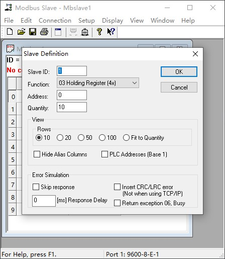
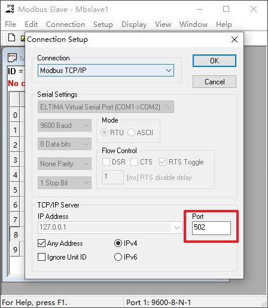
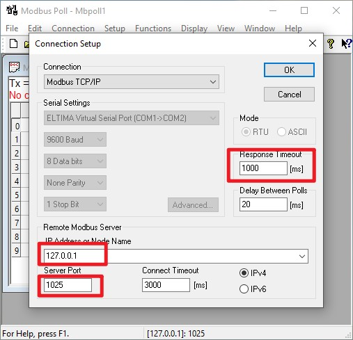

# 示例说明

## 1、介绍

该示例提供 RTU / TCP 主机和从机的功能演示。

`WSL` 或 `Linux` 下使用 `gcc` 可直接 `make all` 编译出所有示例，在电脑上运行测试程序。

## 2、使用

需要准备的工具如下：

- 虚拟串口软件
- Modbus Poll
- Modbus Slave

命令行敲击 `make clean` 、 `make all` 。

### 2.1、主机

- RTU

  - 使用虚拟串口软件虚拟出一对串口

    

  - 打开 `Modbus Slave` ，按下图设置

    

  - `Modbus Slave` 连接，按下图设置

    

  - `./RtuMaster /dev/ttySX` 运行 `RTU` 主机示例，`ttySX` 为一对虚拟串口中的另一个

    

- TCP

  - 打开 `Modbus Slave`，`SetUp` 设置同 `RTU` 一致

  - `Modbus Slave` 连接，按下图设置

    

  - `./TcpMaster 127.0.0.1 502` 运行 `TCP` 主机示例

    

### 2.2、从机

该示例同时提供 `RTU` 和 `TCP` 从机功能演示，控制的是同一片内存。`TCP` 最大可接入 5 个客户端，每个客户端无数据超时为 10s, 10s 后自动断开。

示例支持所有功能码(除了功能码 0x07)。

**注意**：

1. 所有寄存器示例中只有地址 0~9 总共 10 个寄存器有效，读写其他地址寄存器都能成功，但值都为 0。

2. 寄存器地址不能超出 `0xFFFF`。

使用：

- 使用虚拟串口软件虚拟出一对串口

  

- `./ModbusSlave /dev/ttyS2 1025` 运行示例

  /dev/ttySX: 虚拟串口中的一个

  1025：监听端口号，如果不是 `root` 权限，端口号必须大于 `1024`

- 打开 `Modbus Poll` 按下图设置和连接 RTU

  

  

- 打开 5 个 `Modbus Poll` ，设置同 RTU，连接如下图

  

- 效果演示

  

- 超时断开演示

  将 `Modbus Poll` 的 poll 界面关闭，看控制台打印可以看到 close 报文。

  
