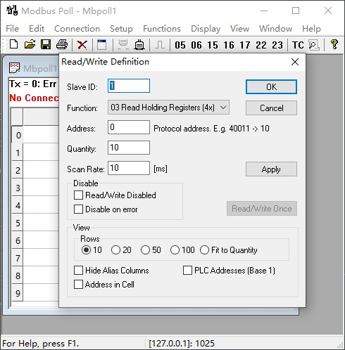
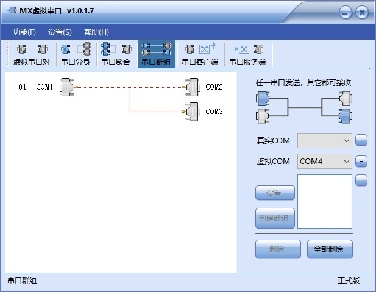

# 示例说明

## 1、介绍

该示例提供 RTU / TCP 主机和从机的功能演示。

`WSL` 或 `Linux` 下使用 `gcc` 可直接 `make all` 编译出所有示例，在电脑上运行测试程序。

目录结构：

| 名称 | 说明 |
| ---- | ---- |
| common | 公用源码 |
| figures | 素材 |
| rtu_master | RTU 主机示例 |
| tcp_master  | TCP 主机示例 |
| slave  | RTU + TCP 从机示例 |
| rtu_p2p  | RTU 点对点传输文件 |
| rtu_broadcast  | RTU 广播传输文件 |

## 2、使用

需要准备的工具如下：

- 虚拟串口软件
- Modbus Poll
- Modbus Slave

命令行敲击 `make clean` 、 `make all` 。

### 2.1、主机

- RTU (rtu_master)

  - 使用虚拟串口软件虚拟出一对串口

    

  - 打开 `Modbus Slave` ，按下图设置

    

  - `Modbus Slave` 连接，按下图设置

    

  - 进入 `rtu_master` 目录，`./RtuMaster /dev/ttySX` 运行 `RTU` 主机示例，`ttySX` 为一对虚拟串口中的另一个

    

- TCP (tcp_master)

  - 打开 `Modbus Slave`，`SetUp` 设置同 `RTU` 一致

  - `Modbus Slave` 连接，按下图设置

    

  - 进入 `tcp_master` 目录，`./TcpMaster 127.0.0.1 502` 运行 `TCP` 主机示例

    

### 2.2、从机

该示例 (slave) 同时提供 `RTU` 和 `TCP` 从机功能演示，控制的是同一片内存。`TCP` 最大可接入 5 个客户端，每个客户端无数据超时为 10s, 10s 后自动断开。

示例支持所有功能码(除了功能码 0x07)。

回调函数的处理在 `slave.c` 中，其他源码只是建立不同硬件接口的链接。

**注意**：

1. 所有寄存器示例中只有地址 0~9 总共 10 个寄存器有效，读写其他地址寄存器都能成功，但值都为 0。

2. 寄存器地址不能超出 `0xFFFF`。

使用：

- 使用虚拟串口软件虚拟出一对串口

  

- 进入 `slave` 目录，`./ModbusSlave /dev/ttyS2 1025` 运行示例

  /dev/ttySX: 虚拟串口中的一个

  1025：监听端口号，如果不是 `root` 权限，端口号必须大于 `1024`

- 打开 `Modbus Poll` 按下图设置和连接 RTU

  

  

- 打开 5 个 `Modbus Poll` ，设置同 RTU，连接如下图

  

- 效果演示

  

- 超时断开演示

  将 `Modbus Poll` 的 poll 界面关闭，看控制台打印可以看到 close 报文。

  

### 2.3、RTU 传输文件

使用 `0x50` 作为传输文件的特殊功能码。

分包传输文件数据，每包数据最大 1024 字节。

`Data` 字段协议定义：

- 主机请求

  | 命令 | 字节数 | 数据 |
  | ---- | ---- | ---- |
  | 2 Bytes | 2 Bytes | N Bytes |

  命令:

  | 命令 | 说明 | 数据 |
  | ---- | ---- | ---- |
  | 0x0001 | 开始发送 | 文件大小(4 Bytes) + 文件名称(字符串) |
  | 0x0002 | 传输数据 | 标志(1 Byte) + 文件数据 |

  标志:

  | 状态 | 说明 |
  | ---- | ---- |
  | 0x00 | 最后一包数据 |
  | 0x01 | 不是最后一包数据 |

- 从机响应

  | 命令 | 状态 |
  | ---- | ---- |
  | 2 Bytes | 1 Byte |

  状态:

  | 状态 | 说明 |
  | ---- | ---- |
  | 0x00 | 失败 |
  | 0x01 | 成功 |

#### 2.3.1、点对点传输

- 使用虚拟串口软件虚拟出 3 个串口，组成串口群组

  这里我使用的时 MX 虚拟串口

  

- 进入 `rtu_p2p` 目录，打开 `Linux Shell`，演示效果如下

  **注意**:

  - 传输的文件必须是一般文件，像可执行文件、目录等不支持

  - 从机接收到数据后修改文件名称 (从机地址_原文件名) 写入在当前目录。

  

#### 2.3.2、广播传输
