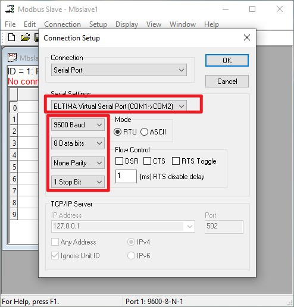
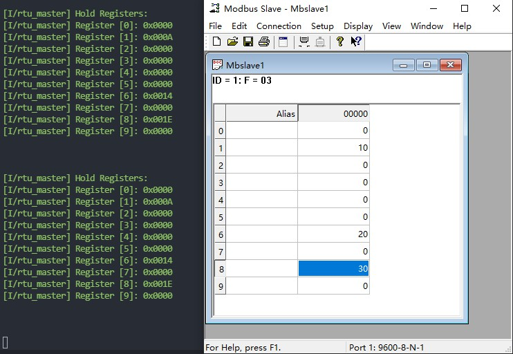
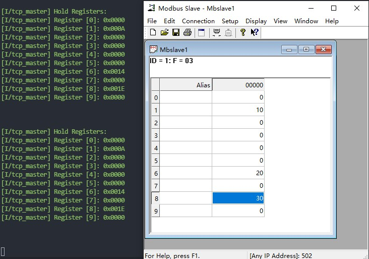

# 示例说明

## 1、介绍

该示例提供 RTU / TCP 主机和从机的功能演示。

`WSL` 或 `Linux` 下使用 `gcc` 可直接 `make all` 编译出所有示例，在电脑上运行测试程序。

## 2、使用

需要准备的工具如下：

- 虚拟串口软件
- Modbus Poll
- Modbus Slave

命令行敲击 `make clean` 、 `make all` 。

### 2.1、主机

- RTU

  - 使用虚拟串口软件虚拟出一对串口

  

  - 打开 `Modbus Slave` ，按下图设置

  

  - `Modbus Slave` 连接，按下图设置

  

  - `./RtuMaster /dev/ttySX` 运行 `RTU` 主机示例，`ttySX` 为一对虚拟串口中的另一个

  

- TCP

  - 打开 `Modbus Slave`，`SetUp` 设置同 `RTU` 一致

  - `Modbus Slave` 连接，按下图设置

  

  - `./TcpMaster 127.0.0.1 502` 运行 `TCP` 主机示例

  

### 2.2、从机

该示例提供 `RTU` 和 `TCP` 从机功能演示。`TCP` 最大可接入 5 个客户端，每个客户端无数据超时为 10s。

示例支持 1、2、3、4、5、6、15、16 功能码。

`./ModbusSlave /dev/ttyS2 1025`

/dev/ttySX: 虚拟串口中的一个

1025：监听端口号，如果不是 `root` 权限，端口号必须大于 `1024`
